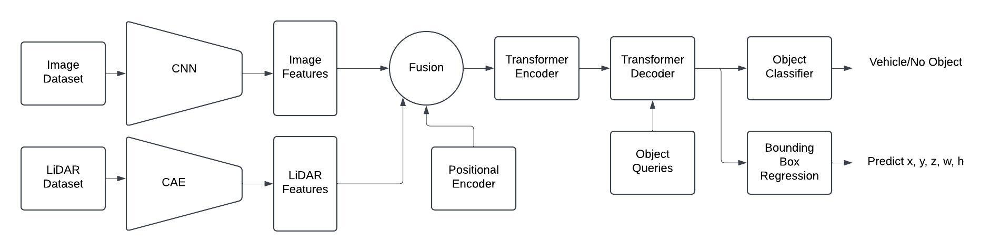

# Multimodal Transformer Fusion of LiDAR and Camera Data for Vehicle Detection

## Overview
This repository contains the implementation of our project, *Multimodal Transformer Fusion of LiDAR and Camera Data for Vehicle Detection*, developed as part of Georgia Tech's CS 7643 course. The project leverages multimodal data (LiDAR and camera) to enhance vehicle detection using a DETR-inspired transformer-based framework.

Our work demonstrates the advantages of multimodal fusion over unimodal detection systems, achieving significant improvements in object detection performance on the Waymo Open Dataset.

---

## Table of Contents
- [Background](#background)
- [Approach](#approach)
  - [Dataset](#dataset)
  - [Model Architecture](#model-architecture)
    - [Early Fusion Framework](#early-fusion-framework)
    - [Positional Encoding](#positional-encoding)
    - [Transformer Encoder-Decoder](#transformer-encoder-decoder)
    - [Attention Mechanism](#attention-mechanism)
    - [Loss Functions](#loss-functions)
- [Results](#results)
  - [Metrics](#metrics)
  - [Key Observations](#key-observations)
- [Getting Started](#getting-started)
  - [Prerequisites](#prerequisites)
  - [Installation](#installation)
  - [Dataset Preparation](#dataset-preparation)
  - [Feature Extraction](#feature-extraction)
  - [Training the Model](#training-the-model)
  - [Running Visualizations](#running-visualizations)
  - [Baseline Mask R-CNN](#baseline-mask-r-cnn)
  - [Inference](#inference)
- [Code Structure](#code-structure)
- [Examples](#examples)
- [Contributions](#contributions)
- [References](#references)
- [Citation](#citation)

---

## Background
Accurate real-time vehicle detection is essential for applications like autonomous driving. Unimodal detection systems face challenges:
- **Camera-only detection** suffers from poor depth perception and occlusions.
- **LiDAR-only detection** struggles with sparse point clouds and low-resolution.

To address these limitations, our project combines:
- **Contextual richness** from image data.
- **Spatial precision** from LiDAR data.

We explore a DETR-inspired architecture that integrates both modalities using early fusion techniques, enabling more robust and accurate vehicle detection.

---

## Approach
### Dataset
We used the **Waymo Open Dataset**, which provides synchronized camera and LiDAR data under diverse conditions (e.g., weather, lighting, and traffic).

### Model Architecture
#### Model Architeture Diagram

Our model adapts the DETR (DEtection TRansformer) architecture to handle multimodal data fusion. Key components include:
#### Early Fusion Framework
We combined image and LiDAR features early in the pipeline to create a unified high-dimensional representation. This process helps leverage the strengths of both modalities:
- **Image features** provide rich contextual information about the scene.
- **LiDAR features** contribute precise spatial and depth information.

#### Positional Encoding
To preserve spatial relationships, we used sinusoidal positional encodings:
```plaintext
PE(pos, 2i)   = sin(pos / 10000^(2i / d_model))
PE(pos, 2i+1) = cos(pos / 10000^(2i / d_model))
```
where `pos` is the position index, `i` is the dimension index, and `d_model` is the feature dimension.

#### Transformer Encoder-Decoder
- **Encoder:** Processes fused features using self-attention mechanisms. The encoder outputs contextualized feature representations.
- **Decoder:** Uses learnable object queries to predict bounding boxes and class labels.

#### Attention Mechanism
Attention computes weights for each input element, enabling the model to focus on relevant features:
```plaintext
Attention(Q, K, V) = softmax(QK^T / sqrt(d_k)) * V
```
where:
- `Q` (query): Represents the current element being processed.
- `K` (key): Represents other elements to compare against.
- `V` (value): Represents features to be weighted.
- `d_k`: Dimensionality of the key.

Multi-head attention extends this by splitting the input into multiple subspaces:
```plaintext
MultiHead(Q, K, V) = Concat(head_1, ..., head_h) * W_o
```
where each `head_i = Attention(QW_i^Q, KW_i^K, VW_i^V)` with learned weight matrices `W_i`.

The overall forward pass can be expressed as:
```plaintext
F_fused  = Concat(F_image, F_LiDAR)
F_output = Decoder(Encoder(F_fused))
```

#### Loss Functions
The model minimizes a multi-task loss function:
```plaintext
L_total = α * L_class + β * L_reg + γ * L_IoU
```
where:
- `L_class`: Cross-entropy loss for classification.
- `L_reg`: Smooth L1 loss for bounding box regression.
- `L_IoU`: Generalized Intersection over Union (GIoU) loss.

Hyperparameters `α`, `β`, and `γ` control the relative importance of each term.

---

## Results
### Metrics
Our model was compared against:
1. **Image-only detection**
2. **LiDAR-only detection**
3. **Baseline Mask R-CNN**

| Metric                | Image-Only | LiDAR-Only | Fusion Model | Mask R-CNN |
|-----------------------|------------|------------|--------------|------------|
| Mean IoU             | 0.274      | 0.284      | **0.345**    | 0.333      |
| F1 Score             | 0.202      | 0.191      | **0.257**    | 0.208      |
| mAP                  | 0.077      | 0.066      | **0.104**    | 0.087      |

### Key Observations
- **Improved Accuracy:** Fusion model consistently outperforms unimodal models.
- **Real-time Suitability:** Faster inference than Mask R-CNN, making it viable for autonomous driving applications.

---

## Getting Started
### **Prerequisites**
Ensure you have the following installed:
- **Conda**: [Installation Guide](https://docs.conda.io/projects/conda/en/latest/user-guide/install/)

### **Step 1: Clone the Repository**

git clone https://github.com/125918700/CS-7643-Final-Project.git
cd ./CS-7643-Final-Project

### **Step 2: Create and Activate Conda Environment**

conda create -n mm-fusion-ped-det python=3.10
conda activate mm-fusion-ped-det


### **Step 3: Install Dependencies**

#### **3.1 Install TensorFlow**

To ensure compatibility with Waymo tools, install TensorFlow **2.11.0**:

pip install tensorflow==2.11.0

#### **3.2 Install Core Libraries**

pip install torch torchvision torchaudio transformers numpy

#### **3.3 Install Waymo Open Dataset Tools**

For TensorFlow **2.11+**, install Waymo Open Dataset Tools using pip:

pip install waymo-open-dataset-tf-2-11-0

### **Step 4: Verify Installation**

Run the following script to verify your environment setup:

python -c "
import tensorflow as tf
from waymo_open_dataset import dataset_pb2 as open_dataset
import torch

print('TensorFlow Version:', tf.__version__)
print('PyTorch Version:', torch.__version__)
print('Waymo Open Dataset Installed Successfully!')
"

### Dataset Preparation
1. Download the Waymo Open Dataset.
2. Preprocess the dataset using the following command:
   ```bash
   python preprocess_data.py --dataset_path /path/to/waymo --output_path /path/to/output
   ```

### Feature Extraction
#### Image Features
The `imgFeature_extractor.py` script extracts image features using a pre-trained ResNet-50 model. Ensure the following directories exist:
- **Input Directory:** `./dataset/compressed_camera_images2` (default input folder for `.jpg` images).
- **Output Directory:** `./data/image_features_more_layers` (default output folder).

Run the script:
```bash
python imgFeature_extractor.py
```
The extracted features will be saved in the specified output directory.

#### LiDAR Features
The `lidarFeature_extractor.py` script extracts LiDAR features. Ensure the following directories exist:
- **Input Directory:** `./dataset/raw_lidar_files` (default input folder for LiDAR point cloud files).
- **Output Directory:** `./dataset/lidar_projected_cae_resized` (default output folder).

Run the script:
```bash
python lidarFeature_extractor.py
```
The processed LiDAR features will be saved in the output directory.

### Training the Model
Train the fusion model by ensuring the following paths are set:
- **Image Features Directory:** `./data/image_features_more_layers`
- **Annotation Directory (Pickle files):** `./dataset/cam_box_per_image`
- **LiDAR Features Directory:** `./dataset/lidar_projected_cae_resized`

Run the training script:
```bash
python trainer.py
```
The model and checkpoints will be saved to `./data/models/`.

### Running Visualizations
Generate visualizations of model predictions by setting:
- **Model Path:** Path to the trained model checkpoint (e.g., `./data/models/best_model.pth`)
- **Data Directories:**
  - Annotations: `./dataset/cam_box_per_image`
  - Image Features: `./data/image_features_more_layers`
  - LiDAR Features: `./dataset/lidar_projected_cae_resized`
- **Output Directory:** Directory for saving visualizations (default: `./data/visualizations/`)

Run the visualization script:
```bash
python visualizations.py
```
The visualizations will be saved in the specified output directory.

### Baseline Mask R-CNN
To run the baseline Mask R-CNN model:
```bash
python baseline_model_maskRCNN.py 
```

### Inference
Run inference on test data using the trained fusion model:
```bash
python output_model_prediction.py 
```

---

## Code Structure
```
CS-7643-Final-Project/
├── data/                          # Scripts and data for preprocessing and storage
├── dataset/                       # Dataset containing waymo dataset
├── plots/                         # Plots for learning curves and metrics visualization
├── images/                        # Images used in documentation or visualizations
├── Metrics.py                     # Script for calculating evaluation metrics
├── mm_fusion_detector.py          # Multimodal fusion detector implementation
├── mm_fusion_detector_dataset.py  # Dataset management for multimodal fusion detector
├── trainer.py                     # Main script for training the multimodal fusion model
├── visualizations.py              # Script for generating visualizations of model predictions
├── imgFeature_extractor.py        # Script for extracting image features using ResNet-50
├── lidarFeature_extractor.py      # Script for extracting and projecting LiDAR features
├── baseline_model_maskRCNN.py     # Baseline Mask R-CNN implementation
├── output_model_prediction.py     # Script for running model inference
├── enviroment.yml                 # Environment setup file for dependencies
├── .gitignore                     # Files and directories to ignore in version control
└── README.md                      # Project overview and instructions
```

---

## Examples
### Fusion Model Detection
Below are examples of detection outputs from the fusion model:

#### Example 1


#### Example 2


---

## Contributions
| Name           | Contributions                                               |
|----------------|-------------------------------------------------------------|
| Felix Galindo  | Model implementation, image feature extraction, training    |
| Yunmiao Wang   | Data preprocessing, LiDAR feature extraction, inference     |
| Xinyao Wang    | Experiments, result analysis, baseline model implementation |

---

## References
1. Carion, N. et al. "End-to-end Object Detection with Transformers." arXiv:2005.12872.
2. Wang, Y. et al. "Multi-modal 3D Object Detection in Autonomous Driving: A Survey." Int. J. Comput. Vis., 2023.
3. Liu, H. et al. "Real Time Object Detection Using LiDAR and Camera Fusion for Autonomous Driving." Sci. Rep., 2022.

---

## Citation
If you use this work, please cite:
```
@misc{galindo2024multimodal,
  author = {Felix Galindo, Yunmiao Wang, Xinyao Wang},
  title = {Multimodal Transformer Fusion of LiDAR and Camera Data for Vehicle Detection},
  year = {2024},
  url = {https://github.com/125918700/CS-7643-Final-Project}
}
```
